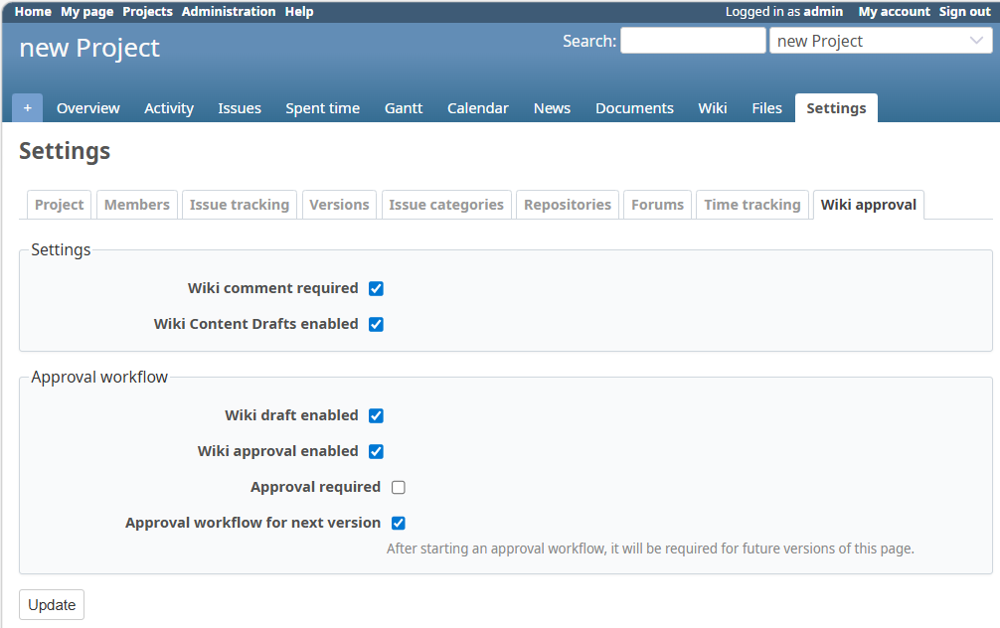
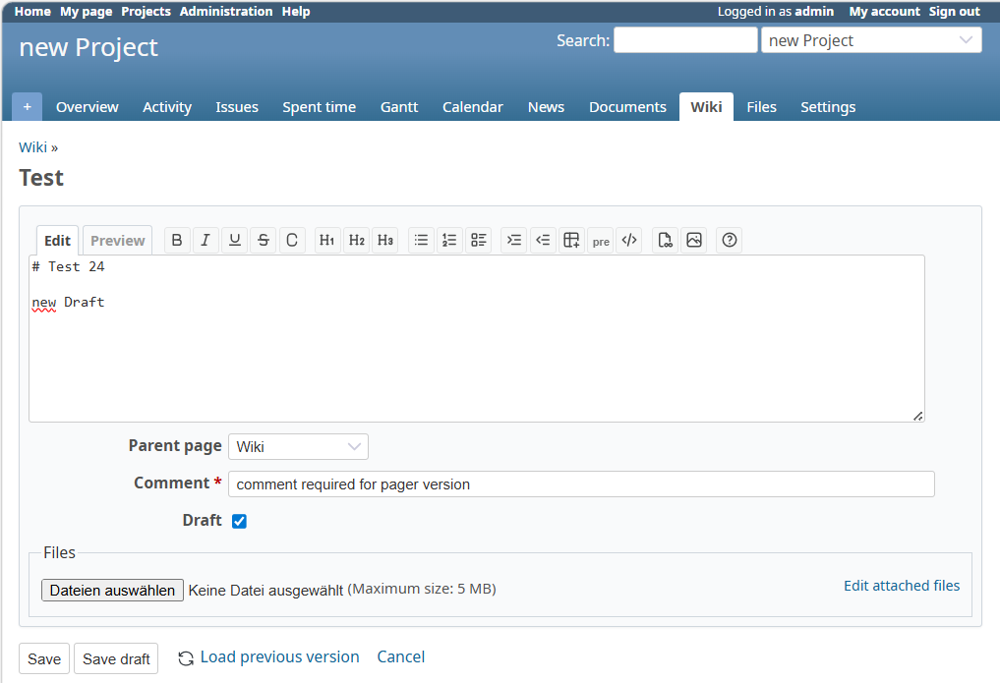
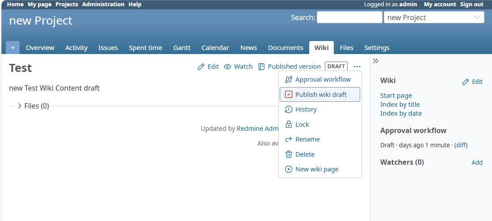
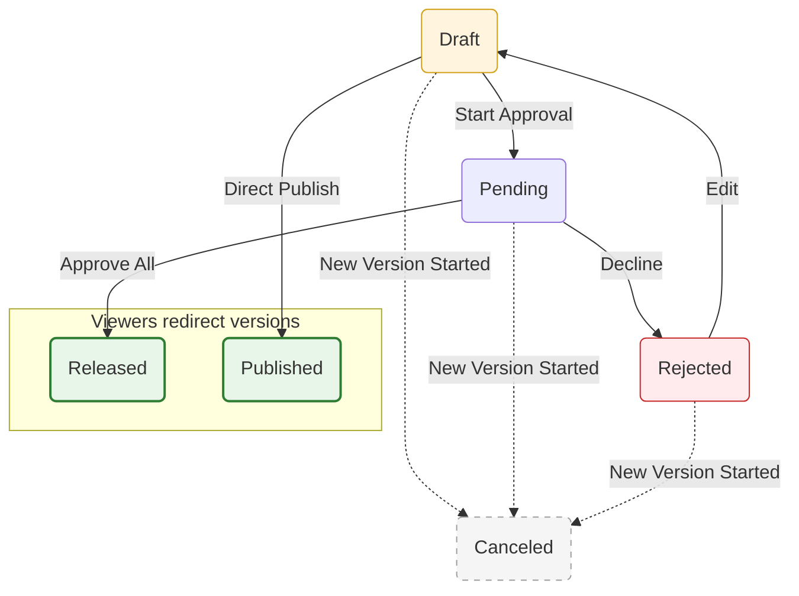

# Redmine Wiki Approval Plugin

[](https://github.com/FloWalchs/redmine_wiki_approval/actions/workflows/build.yml)
[](https://github.com/FloWalchs/redmine_wiki_approval/releases/latest)
[](https://www.redmine.org/plugins/redmine_wiki_approval)

[](https://codecov.io/gh/FloWalchs/redmine_wiki_approval)
[](https://flowalchs.github.io/redmine_wiki_approval/)

This plugin adds an approval workflow to the wiki, allowing teams to review, approve, and control changes before they are published. It supports drafts, multi‑step approval processes, role‑based permissions, and status tracking to ensure content quality and traceability in collaborative documentation.

## 🧠 How it works

This plugin does **not** replace Redmine's wiki versioning, but optimizes it:

- **Smart Drafting**: Save your progress as a draft without creating a new Redmine wiki version. This keeps the history clean while you work.
- **Normal Versioning**: Once a change is finalized (or submitted), it is saved as a standard Redmine wiki version.
- **Privacy**: Drafts and unapproved changes remain private/hidden from regular viewers.
- **Approval Logic**: Only approved versions are displayed as the public wiki page.
- **Seamless Navigation**: Viewers are automatically redirected to the latest approved version.
- **Prerequisite**: Permission 'View wiki history' should be enabled for the redirection.

## 🌟 Features

- **Draft-Based Editing** – Work on changes without publishing them
- **Multi-Step Approval Workflow** – Configurable approval steps before publishing
- **Approval Activity View** – Track approval status by redmine activity feed
- **Role-Based Permissions** – Control who can draft, approve, or publish
- **REST API & OpenAPI Support** – Fully automate workflows with a modern REST API, including an interactive [OpenAPI Documentation](https://flowalchs.github.io/redmine_wiki_approval/)
- **Email Notifications** – Notifications for status and step changes
- **Per‑Project or Global Settings** – Configure behavior globally or individually per project, such as enabling approval requirements, drafts, or mandatory comments.
- **Mandatory Save Comment** – Requires users to enter a comment when saving Wiki content (configurable on/off)
- **My Page Blocks** – Manage your Wiki Approval Queue for pending reviews and track your own Wiki Drafts directly from your personal dashboard

## 🔐 Permissions Overview

| Permission           | Description                                       |
| -------------------- | ------------------------------------------------- |
| Manage Wiki approval | Configure workflow and settings                   |
| Start approval       | Begin approval workflow                           |
| Grant approval       | Approve a workflow step                           |
| Forward approval     | Move to another approver                          |
| View draft           | View unpublished versions                         |
| Publish wiki drafts  | Release an approved draft as the official version |

## 💡 Typical Use Case

1. Author creates or edits a wiki page as a draft
2. Changes are reviewed in one or more approval steps
3. Reviewers approve or reject the changes
4. Once approved, the page becomes publicly visible
5. Older versions remain accessible for audit and rollback

## 🌐 Internationalization
The plugin supports 14+ languages, including English, German, Japanese, French, Spanish, and more.
- <u>Full Support:</u> English and German are currently the primary maintained languages.
- <u>Experimental:</u> Other languages are currently in an experimental state.
- <u>Contribute:</u> Pull Requests to improve or add translations for your language are highly welcome!

## 📋 Requirements

- **Redmine**: 4.2 or higher
- **Ruby**: 2.7 or higher
- **Rails**: Compatible with Redmine's Rails version

## 🚀 Installation

```bash
cd $REDMINE_ROOT/plugins
git clone https://github.com/FloWalchs/redmine_wiki_approval.git
cd $REDMINE_ROOT
bundle install
bundle exec rake redmine:plugins:migrate RAILS_ENV=production
```
Restart your Redmine server to load the plugin.
Enable the Module "Wiki approval" per project

## ⚙️ Plugin/Project Configuration

1. Navigate to **Administation → Wiki approval**
   - Settings can be configured per project or system-wide
2. Navigate to **Project Settings → Wiki approval**
   - enable the modul per project
3. Available options:
   - Settings 
     - Wiki comment required 
     - Wiki Content Drafts enabled
   - Approval workflow
     - Wiki draft enabled
     - Wiki approval enabled
       - Approval required
       - Approval workflow for next version (required)

## 🖼️ Screenshots

<div align="left">
  <table>
    <tr>
      <td align="center">
        
        <br>
        <sub><b>Project Settings</b></sub>
      </td>
      <td align="center">
        
        <br>
        <sub><b>Page Edit</b></sub>
      </td>
      <td align="center">
        
        <br>
        <sub><b>Draft created</b></sub>
      </td>
    </tr>
    <tr>
      <td align="center">
        
        <br>
        <sub><b>Start approval</b></sub>
      </td>
      <td align="center">
        
        <br>
        <sub><b>in Approval</b></sub>
      </td>
      <td align="center">
        
        <br>
        <sub><b>Grant Approval</b></sub>
      </td>
    </tr>
    <tr>
      <td align="center">
        
        <br>
        <sub><b>Approved step 1</b></sub>
      </td>
      <td align="center">
        
        <br>
        <sub><b>Released, all steps are approved</b></sub>
      </td>
      <td align="center">
        
        <br>
        <sub><b>My page</b></sub>
      </td>
    </tr>
    <tr>
      <td align="center">
        
        <br>
        <sub><b>Publish wiki draft, without approval steps</b></sub>
      </td>
      <td align="center">
      </td>
      <td align="center">
      </td>
    </tr>
  </table>
</div>

## 🔄 Workflow Status Flow

The following diagram illustrates the lifecycle of a wiki page within the approval system:



## ❌ Uninstall

```bash
cd $REDMINE_ROOT
bundle exec rake redmine:plugins:migrate NAME=redmine_wiki_approval VERSION=0 RAILS_ENV=production
```

## 🤝 Contributing
Pull requests, translations, and feedback are welcome.

## 📜 License
MIT License
